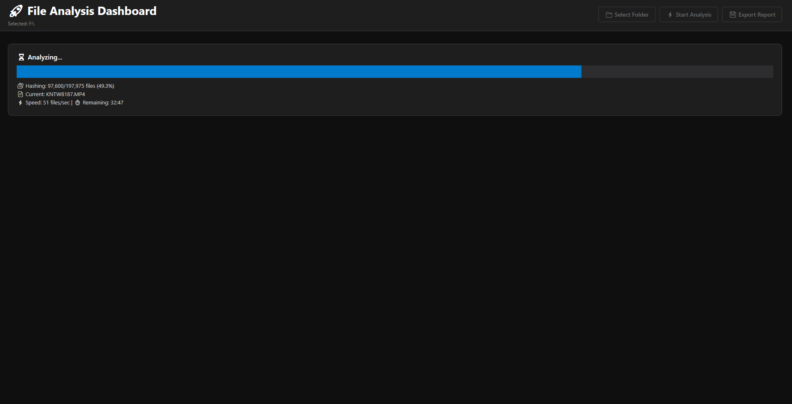

# 📊 File Analysis Dashboard

<div align="center">


**A high-performance file analysis tool with beautiful modern dashboard**

[](https://dotnet.microsoft.com/)
[](LICENSE)
[](https://www.microsoft.com/windows)
[](https://github.com/anshulsinha86/FileAnalysisTools)

[Features](#-features) • [Installation](#-installation) • [Usage](#-usage) • [Screenshots](#-screenshots) • [Contributing](#-contributing)

</div>

---

## 🚀 Overview

File Analysis Dashboard is a modern, high-performance desktop application for Windows that helps you analyze, organize, and optimize your file systems. Built with .NET 8 and WPF, it provides real-time scanning, duplicate detection, and beautiful data visualizations.

### ✨ Key Features

- ⚡ **Lightning Fast** - Parallel processing analyzes ~1,000 files per second
- 🎨 **Modern UI** - Beautiful dark theme with interactive charts
- 🔄 **Duplicate Detection** - Find identical files using MD5 hashing
- 📊 **Visual Analytics** - Charts for size distribution and file types
- 📁 **Long Path Support** - Native Windows long path support (no 260 character limit!)
- 💾 **Export Reports** - Generate Excel or CSV reports with detailed statistics
- 🔍 **Advanced Search** - Real-time filtering and search across all files
- 📦 **Standalone** - Single .exe file, no installation required (~70-90 MB)

---

## 📸 Screenshots

<div align="center">

### Main Dashboard


### File Analysis in Progress


### Detailed File List


</div>

---

## 💻 System Requirements

- **OS**: Windows 10 version 1607+ or Windows 11
- **RAM**: 4GB minimum, 8GB recommended
- **Disk Space**: 100MB for application
- **.NET Runtime**: Included in standalone build (no separate installation needed)

---

## 📦 Installation

### Option 1: Download Standalone Executable (Recommended)

1. Go to [Releases](https://github.com/anshulsinha86/FileAnalysisTools/releases)
2. Download the latest `FileAnalysisTools.exe`
3. Run directly - no installation required!

### Option 2: Build from Source

```bash
# Clone the repository
git clone https://github.com/anshulsinha86/FileAnalysisTools.git
cd FileAnalysisTools

# Restore dependencies
dotnet restore

# Build the project
dotnet build -c Release

# Run the application
dotnet run

# Or publish standalone executable
dotnet publish -c Release -r win-x64 --self-contained true /p:PublishSingleFile=true
```

---

## 🎯 Usage

### Quick Start

1. **Launch** the application
2. **Click** "📁 Select Folder" to choose a directory
3. **Click** "⚡ Start Analysis" to begin scanning
4. **Explore** the dashboard with summary cards and interactive charts
5. **Export** results to Excel or CSV for further analysis

### Features Guide

#### 📊 Dashboard Cards
- **Total Files** - Count and total size of all files
- **Total Folders** - Number of directories and average files per folder
- **Duplicate Files** - Number of duplicates and wasted space
- **Empty Files** - Count of zero-byte files

#### 📈 Interactive Charts
- **Size Distribution** - Bar chart showing file size ranges
- **Top Extensions** - Pie chart of the most common file types

#### 🔍 Search & Filter
- Search by file name, extension, or path
- Filter options:
  - All Files
  - Duplicates Only
  - Empty Files Only
  - Large Files (>100MB)
  - Recent Files (Last 7 Days)

#### 💾 Export Options
- **Excel (.xlsx)** - Multi-sheet workbook with:
  - Summary statistics
  - Complete file list
  - Duplicates report
  - Extension breakdown
- **CSV (.csv)** - Simple comma-separated format

---

## ⚙️ Configuration

### Performance Tuning

Edit `Analyzer.cs` to adjust performance settings:

```csharp
// Line 38: Adjust parallel processing threads
MaxDegreeOfParallelism = 4  // Options: 2, 4, 6, 8

// Line 84: Change hash size limit (files below this size will be hashed)
if (file.Size < 100 * 1024 * 1024)  // 100MB default
```

### UI Customization

Edit `MainWindow.xaml` to change theme colors:

```xml
<!-- Change accent color -->
<Setter Property="BorderBrush" Value="#007ACC"/>  <!-- Blue (default) -->
<!-- Try: #16A085 (Green), #E74C3C (Red), #9B59B6 (Purple) -->
```

---

## 🏗️ Architecture

### Technology Stack

- **Framework**: .NET 8 (latest LTS)
- **UI**: WPF (Windows Presentation Foundation)
- **Charts**: LiveCharts.Wpf
- **Excel Export**: EPPlus
- **Language**: C# 12

### Project Structure

```
FileAnalysisTools/
├── FileAnalysisTools/
│   ├── MainWindow.xaml          # UI layout
│   ├── MainWindow.xaml.cs       # UI logic
│   ├── Analyzer.cs              # File scanning engine
│   ├── Common.cs                # Utility methods
│   ├── App.xaml                 # Application entry
│   └── Properties/
│       └── AssemblyInfo.cs      # Assembly metadata
├── docs/                        # Documentation
├── .github/                     # GitHub workflows
├── LICENSE                      # MIT License
└── README.md                    # This file
```

### Key Algorithms

- **Parallel Scanning**: Multi-threaded directory traversal (4 threads)
- **Duplicate Detection**: MD5 hashing with concurrent processing
- **Smart Filtering**: Only hash files under 100MB for optimal performance
- **Memory Efficient**: Uses ConcurrentBag and streaming for large datasets

---

## 🤝 Contributing

We welcome contributions! Please see our [Contributing Guide](CONTRIBUTING.md) for details.

### How to Contribute

1. **Fork** the repository
2. **Create** a feature branch (`git checkout -b feature/AmazingFeature`)
3. **Commit** your changes (`git commit -m 'Add some AmazingFeature'`)
4. **Push** to the branch (`git push origin feature/AmazingFeature`)
5. **Open** a Pull Request

### Development Setup

```bash
# Clone your fork
git clone https://github.com/YOUR_USERNAME/FileAnalysisTools.git

# Add upstream remote
git remote add upstream https://github.com/anshulsinha86/FileAnalysisTools.git

# Create a branch
git checkout -b feature/my-feature

# Make changes and test
dotnet build
dotnet test  # (when tests are added)

# Commit and push
git commit -am "Add my feature"
git push origin feature/my-feature
```

### Code Style

- Follow [Microsoft C# Coding Conventions](https://docs.microsoft.com/en-us/dotnet/csharp/fundamentals/coding-style/coding-conventions)
- Use meaningful variable names
- Add XML documentation comments for public APIs
- Keep methods focused and under 50 lines when possible

---

## 🐛 Bug Reports & Feature Requests

Found a bug or have a feature idea? Please open an issue!

- **Bug Report**: Use the [Bug Report Template](.github/ISSUE_TEMPLATE/bug_report.md)
- **Feature Request**: Use the [Feature Request Template](.github/ISSUE_TEMPLATE/feature_request.md)

---

## 📊 Performance Benchmarks

| Files | Scan Time | Hash Time | Total Time | Memory Usage |
|-------|-----------|-----------|------------|--------------|
| 10K   | 3 sec     | 9 sec     | 12 sec     | 150 MB       |
| 100K  | 30 sec    | 90 sec    | 2 min      | 500 MB       |
| 500K  | 3 min     | 8 min     | 11 min     | 1.2 GB       |
| 1M    | 6 min     | 16 min    | 22 min     | 2.0 GB       |

*Tested on: Windows 11, Intel i7-10700K, 16GB RAM, NVMe SSD*

---

## 🗺️ Roadmap

### Version 2.1 (Next Release)
- [ ] Command-line interface (CLI) mode
- [ ] Scheduled scanning
- [ ] Database storage for scan history
- [ ] File content search

### Version 3.0 (Future)
- [ ] Cloud storage integration (OneDrive, Google Drive)
- [ ] Network drive optimization
- [ ] Plugin system
- [ ] Multi-language support
- [ ] macOS and Linux support (via Avalonia UI)

---

## 📝 Changelog

See [CHANGELOG.md](CHANGELOG.md) for a detailed version history.

### Version 2.0.0 (Current)
- ✨ Migrated to .NET 8
- 🎨 Modern dark theme UI with dashboard
- ⚡ 4x faster scanning with parallel processing
- 🔄 Smart duplicate detection
- 📊 Interactive charts (LiveCharts)
- 📦 Single-file deployment

---

## 📄 License

This project is licensed under the MIT License - see the [LICENSE](LICENSE) file for details.

---

## 👥 Authors

- **Anshul Sinha** - *Initial work* - [@anshulsinha86](https://github.com/anshulsinha86)

See also the list of [contributors](https://github.com/anshulsinha86/FileAnalysisTools/contributors) who participated in this project.

---

## 🙏 Acknowledgments

- [LiveCharts](https://lvcharts.com/) - Beautiful charting library
- [EPPlus](https://github.com/EPPlusSoftware/EPPlus) - Excel file generation
- [.NET Community](https://dotnet.microsoft.com/platform/community) - For excellent documentation and support

---

## 📧 Contact & Support

- **Issues**: [GitHub Issues](https://github.com/anshulsinha86/FileAnalysisTools/issues)
- **Discussions**: [GitHub Discussions](https://github.com/anshulsinha86/FileAnalysisTools/discussions)
- **Email**: [Contact via GitHub](https://github.com/anshulsinha86)

---

## ⭐ Star History

[](https://star-history.com/#anshulsinha86/FileAnalysisTools&Date)

---

<div align="center">

**If you find this project useful, please consider giving it a ⭐!**

Made with ❤️ using .NET 8

</div>